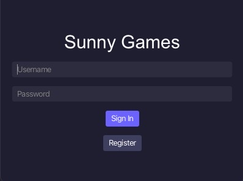
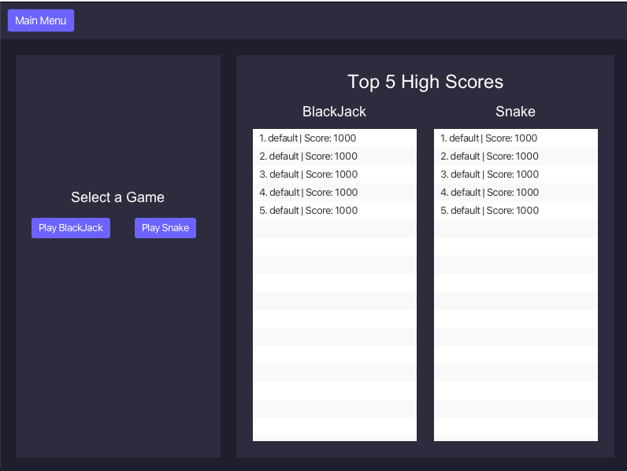
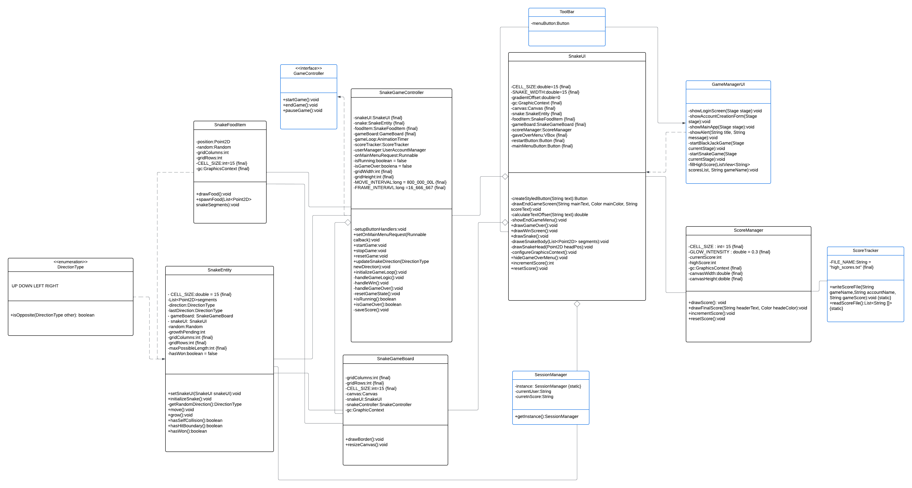

# Game Project2 CS 151

## Overview
**Welcome to the Sunny Games!**
The following project implements a Game Manager and two games: BlackJack and Snake, using JavaFX. 
Both games are implemented from scratch in OOP style to be fully playable. The manager also supports persistent storage for creating and logging in users to keep track of high scores across sessions.
The following description includes an overview, Design and Rules separate for each game, Installation Instructions, Usage, and Contributions.

### **Game Manager**
**Login**: After launching the Game Manager the user can choose between "Sign In" and "Register". To log in, users must input a username and password matching the account created before. If the program is closed and relaunched, the accounts made before are maintained for future use. This data is stored in a separate file.

**High Scores**: The game manager stores high scores from both BlackJack and Snake. The scores consist of a String username and int score stored in a high_scores.txt file. The default starting score of 1000 for both games. 

**Main Menu**: After logging in, the main menu offers two functionalities in visually separate areas. The first area, allows the user to choose the game, and the second area displays the top 5 scores for both games in order from highest to lowest.

**Toolbar**: The toolbar persists throughout the entire application after logging in. No matter which screen is displayed, the toolbar is available for the user and remains identical across both games and the main menu. The toolbar contains the button "Main Menu" that takes the user to the main menu at any point from any application state.

<div style="display: flex; justify-content: center; gap: 10px;">
    
    
</div>


### **BlackJack**
The game supports 1 human player and 3 automated characters (2 other normal players and dealers). 

#### **Features**:
- **Playable Blackjack Game**
  - One human player and two AI players.
  - Dealer follows standard Blackjack rules.
  - Simple controls: Hit, Stand, Start a New Game, Save, and Load.
    
#### **How to Play**
1. Launch the application and select "Play BlackJack" after logging in.
2. The welcome screen offers two options:
   - **New Game:** Starts a new game of Blackjack.
   - **Exit:** Closes the application.
3. Place a bet and begin playing:
   - *Hit:* Draw another card.
   - *Stand:* End your turn.
   - *Bust:* Exceed 21 or more points and automatically lose the
   - The AI players and the dealer will take their turns automatically.
4. The game will determine the winner based on standard Blackjack rules:
   - Closest to 21 without exceeding it wins.
   - A tie results in the bet being returned.

#### **Rules of Blackjack**
1. Each player is dealt two cards initially.
2. Players aim to get a total card value of 21 or as close as possible without exceeding it.
3. Card values:
   - Number cards are worth their face value.
   - Face cards (Jack, Queen, King) are worth 10.
   - Aces are worth 1 or 11, depending on the total value of the hand.
4. The dealer must "Hit" until their hand totals at least 17.
5. Bet: Before each round, players choose some amount of currency to bet.
6. Winners are paid an amount equal to the original wager. Losers with a hand that
busts or is lower than the dealer lose their bet. If the dealer’s hand busts, the
players win. 

#### **Design**
- **AIPlayer**: Represents an AI-controlled player with automated decision-making logic for actions such as hitting or standing based on the current hand value.
- **BlackJackUI**: Provides the graphical user interface for the game, including the welcome screen, game table, and user interactions like buttons for "Hit" and "Stand."
- **Card**: Models a playing card with attributes such as rank, suit, and value, and includes functionality for representing card details.
- **Dealer**: Implements the dealer's behavior, including hitting until reaching a hand value of at least 17, as per Blackjack rules.
- **Deck**:  Manages the deck of cards, including shuffling, dealing cards, and keeping track of remaining cards.
- **GameController**: Handles the core game logic, including managing turns, player actions, betting, and determining the winner at the end of each round.
- **HumanPlayer**: Represents the human player, allowing manual actions such as hitting and standing, and managing their bet and balance.
- **Player**: Serves as the abstract base class for all players (human, AI, dealer), providing common attributes and behaviors like hand management and balance tracking.
---
### Snake
The game allows to grow the snake until the game ends. 



#### **Features**:
- **Playable Snake**
  - Snake moving across the board and collecting food.
  - Food automatically appears on random parts of the screen.
  - Snake grows in size after eating food.

#### **How to Play**
1. Launch the application and select "Play Snake" after logging in.
2. Select "Start Game".
3. Use the arrow key from the keyboard to move the snake and catch the food that is automatically displayed on the screen.
4. The game ends either if the snake crosses itself, hits the side of the board, or grows to the size of the board.

#### **Rules of Snake**
1. The player controls the snake's direction using keyboard arrow keys, and the snake continuously moves in the last direction until the new keyboard is pressed.
2. Food randomly appears on the screen one at a time. The snake increases in size after eating the item.
3. The game ends if the snake collides with the walls or itself.
4. When a game-over condition is triggered, the final score and an option to
restart the game is displayed on the screen.

#### **Design**
- **ScoreManager**: Manages score-related functionality including viewing and score tracking and displays scores in the border area of the game where the snake cannot move
- **SnakeEntity**: Represents the snake entity in the game, handling its movement, growth, and collision detection. This class maintains the snake's position, direction, and size.
- **SnakeFoodItem**: Represents a food item in the Snake game, which the snake consumes to grow and score points. This class handles the random positioning of food on the game grid and provides access to the current food location for collision detection with the snake.
- **SnakeGameBoard**: SnakeGameBoard serves as the main container for the Snake game, managing the canvas and integrating with SnakeUI and SnakeGameController.
- **SnakeGameController**: Controls the game logic, handles user input, and manages the game loop. Coordinates between the snake entity, food, and UI components.
- **SnakeUI**: The SnakeUI class handles all visual aspects of the Snake game
---  

## **Instalation Instructions**:
### Prerequisites
Before setting up the project, ensure you have the following installed on your system:
1. **Java Development Kit (JDK)**: Version 22.0.2 or later.
2. **JavaFX SDK**: Version 23.0.1 or later. 
3. **Git**: To clone the repository.
4. **IDE**: Preferably Visual Studio Code (VSCode).

  ### Steps to Set Up the Project
  1. **Clone the Repository**:
     Open a terminal and clone the repository using the following command:
     ```bash
     git clone https://github.com/AniaNiedzialek/BlackJack_Project2_CS151.git
2. **Navigate to the project directory**
    ```bash
    cd BlackJack_Project2_CS151
3. **Configure JavaFX in IDE**
     for VisualStudio: 
  Open the project in VSCode.
  Ensure your launch.json and settings.json are configured to include JavaFX. Add the following VM arguments in your launch configuration: --module-path /path/to/javafx-sdk-23.0.1/lib --add-modules javafx.controls,javafx.fxml
  where /path/to/javafx-sdk-23.0.1 should be the path to your JavaFX SDK.
4. **Run the Project**
     Run the GameManagerUI class to launch the application.

## **Usage**
On top of the above design descriptions, the usage of the application is as follows:

1. **Run the Application**:
   - Install the application as instructed above.
   - Open your IDE and find the `GameManagerUI` class.
   - Run the `GameManagerUI` class to launch the main menu of the application.

3. **Main Menu**:
   - The main menu allows you to navigate through the different features of the game, including:
     - Creating or logging into an already existing account.
     - Starting a new Blackjack or Snake game.
     - Viewing high scores.
     - Exiting the application.

4. **Playing the Game**:
   - Once you start a new BlackJack game:
     - You will take turns as a human player, alongside two automated players and a dealer.
     - Place your bets at the beginning of each round.
     - Make strategic decisions - hit, stand - during your turn.
     - Your balance will update automatically after each round based on the outcome.
    - Once you start the Snake game:
       - Snake will automatically display on the screen
       - You can move the snake by using the keyboard arrow keys
       - Collect the food to gain more points
       - Avoid self-collisions or hitting a wall

5. **Saving and Loading for BlackJack game**:
   - Save your progress at any time by selecting the "Save Game" option.
   - Load previously saved games to continue from where you left off.

6. **High Scores**:
   - View the leaderboard to see your performance and compare it with others.

7. **Exit**:
   - Exit the games from the main menu.

---


## Contributions
- **Sunny Doan**: Implemented the Game Manager; worked on Login, High Scores, Main Menu, and Toolbar; ensured and fixed potential user input issues; prepared the user interface and enclosure of the game application
- **Mohammed Nassar**: Implemented Snake Game, adding key features to make the game fully playable; worked on and assisted with fixing issues in the BlackJack game and making the game fully playable; wrote Tests
- **Ania Niedzialek**: Implemented BlackJack Game, adding key features for the game layout; prepared UML diagram and README

